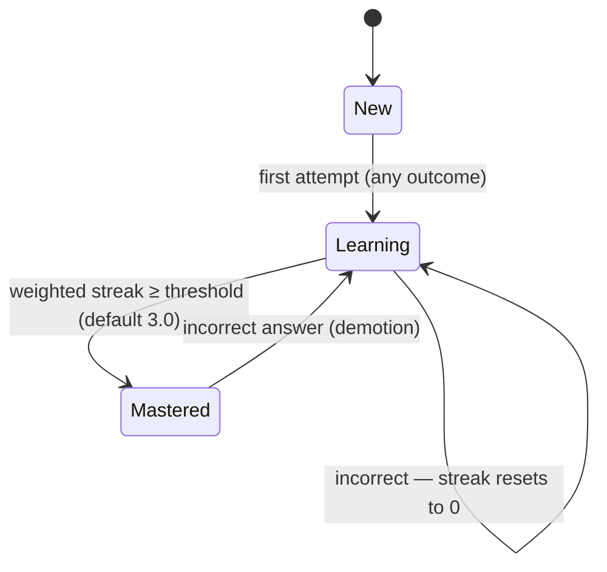

# Mimir — Card Mastery Progress Management Design

> A Quizlet-like per-term progress system: tracks each card's mastery state based on user performance across every study mode, and defines how it hands off into the existing SM-2 spaced-repetition scheduler.

---

## Overview

This design splits progress into two layers that operate on different timescales:

- **Mastery progress engine** (this document) — per-card status (`New` / `Learning` / `Mastered`) within a study set, driven by a weighted correct-answer streak. This is what powers a "12/30 terms mastered" progress bar and decides whether a card still needs active practice.
- **SM-2 spaced-repetition scheduler** (already specified in the TDD, Section 8) — governs when a *mastered* card resurfaces for long-term retention, on a day/week timescale.

A card graduates from the mastery engine into the SRS scheduler the first time it reaches `Mastered`. After that, the two systems stay loosely coupled through one explicit synchronization rule (see "SRS integration" below).

---

## State machine



A single wrong answer always resets the streak to zero, including demoting an already-`Mastered` card back to `Learning`. That asymmetry is intentional: forgetting is a strong signal regardless of which mode produced it, so it always propagates, while progress toward mastery only comes from trustworthy recall.

---

## The core idea: normalize every mode into one event

Every study mode — Flashcards, Learn Mode, Write Mode, Spell Mode, Test Mode, the AI modes — has a different UI and a different way of producing a result. Rather than duplicating mastery logic per mode, each one normalizes its outcome into a single shared event shape before it reaches the progress engine:

```typescript
interface CardAttemptEvent {
  userId: string;
  cardId: string;
  setId: string;
  sessionId: string;
  studyMode: 'FLASHCARD' | 'LEARN' | 'WRITE' | 'SPELL' | 'TEST' | 'AI_FILL_BLANK' | 'AI_GUESS_WORD';
  outcome: 'CORRECT' | 'INCORRECT' | 'SKIPPED';
  hintUsed: boolean;
  attemptedAt: Date;
}
```

That single shape is the entire ingestion surface. Mode-specific logic — Levenshtein matching in Write Mode, multiple-choice scoring in Learn Mode, and so on — stays where it already lives in each mode's controller. Only the normalized result crosses into the progress engine. This is what keeps the system maintainable: one code path to test, one place to change the rules later, no mastery logic scattered across seven study modes.

---

## Not every "correct" is equally trustworthy

A typed answer in Write Mode is real recall. A multiple-choice guess or a self-reported "I know it" in Flashcards is weaker evidence — the user could be guessing or fooling themselves. If every mode counted the same, someone could click "Know it" through an entire Flashcards pass and hit 100% mastery without ever being meaningfully tested. So each mode carries a credit weight, and a hint always halves it regardless of mode:

| Study mode | Outcome type | Weight (no hint) | Weight (hint used) |
|---|---|---|---|
| Flashcards (self-report "Know it") | Self-assessed | 0.5 | 0.25 |
| Learn Mode — multiple choice | Recognition | 0.5 | 0.25 |
| Learn Mode — written | Recall | 1.0 | 0.5 |
| Write Mode | Recall | 1.0 | 0.5 |
| Spell Mode | Recall | 1.0 | 0.5 |
| Test Mode — written / fill-in-blank | Recall | 1.0 | 0.5 |
| Test Mode — multiple choice / true-false | Recognition | 0.5 / 0.3 | 0.25 / 0.15 |
| AI Fill-in-the-Blank | Recall (contextual) | 1.0 | 0.5 |
| AI Guess the Word | Recall (inferential) | 1.0 | 0.5 |
| Match Game | — | not counted | not counted |

Match Game is deliberately excluded from mastery signal. It's a speed/drag-and-drop activity with very little evidentiary value about whether someone actually knows a term — including it would let users farm mastery by replaying the game. It still logs as a "seen" event for engagement stats, just not for progress.

---

## The algorithm

Each `(user, card)` pair has a status and a running `weightedStreak` float. The update rule:

```typescript
function applyAttempt(progress: UserCardProgress, event: CardAttemptEvent): UserCardProgress {
  if (event.outcome === 'SKIPPED') return progress; // no signal either way

  if (event.outcome === 'INCORRECT') {
    return {
      ...progress,
      status: 'LEARNING',          // demotes MASTERED too
      weightedStreak: 0,
      incorrectCount: progress.incorrectCount + 1,
      timesDemoted: progress.status === 'MASTERED'
        ? progress.timesDemoted + 1
        : progress.timesDemoted,
    };
  }

  // CORRECT
  const baseWeight = MODE_WEIGHTS[event.studyMode][questionTypeOf(event)];
  const weight = event.hintUsed ? baseWeight * 0.5 : baseWeight;
  const newStreak = progress.weightedStreak + weight;

  return {
    ...progress,
    status: newStreak >= MASTERY_THRESHOLD ? 'MASTERED' : 'LEARNING',
    weightedStreak: newStreak,
    correctCount: progress.correctCount + 1,
    masteredAt: newStreak >= MASTERY_THRESHOLD && progress.status !== 'MASTERED'
      ? new Date()
      : progress.masteredAt,
  };
}
```

With a default `MASTERY_THRESHOLD` of 3.0, that means three typed correct answers, or six multiple-choice correct answers, or some mix, gets a card to `Mastered`. A hint-assisted answer still moves the streak forward, just at half speed, rather than being treated as either a full pass or a failure.

---

## SRS integration

The first time a card crosses into `Mastered`, that's the trigger to create its `SrsCard` row and hand it off to the SM-2 scheduler — the same "graduation" trigger already described in the roadmap (Progress Tracking epic feeding the SRS epic), now with a precise, mode-aware definition of what "mastered" means.

After graduation, the two systems stay loosely coupled through one explicit rule: an incorrect answer on a card that already has an `SrsCard` row — whether it happens during a formal SRS review or in an ordinary Flashcards re-study — both demotes the mastery status *and* applies an "Again" rating to the SM-2 state, resetting the due date immediately rather than waiting for the next scheduled review. Correct answers outside the dedicated SRS review session do **not** extend the SM-2 interval — only an explicit Again/Hard/Good/Easy rating in the SRS review flow does that. Otherwise casual practice repeats would silently inflate intervals and undermine the spacing.

---

## Data model

```prisma
enum CardMasteryStatus {
  NEW
  LEARNING
  MASTERED
}

model UserCardProgress {
  id              String            @id @default(uuid())
  userId          String
  cardId          String
  setId           String            // denormalized for fast per-set queries
  status          CardMasteryStatus @default(NEW)
  weightedStreak  Decimal           @default(0) @db.Decimal(4,2)
  correctCount    Int               @default(0)
  incorrectCount  Int               @default(0)
  hintsUsedCount  Int               @default(0)
  timesDemoted    Int               @default(0)   // struggle signal, feeds weak-card lists
  lastStudyMode   String?
  lastAttemptedAt DateTime?
  masteredAt      DateTime?
  updatedAt       DateTime          @updatedAt

  @@unique([userId, cardId])
  @@index([userId, setId, status])
}

// One row per (user, set) — avoids a COUNT() aggregate on every dashboard load
model UserSetProgress {
  userId        String
  setId         String
  totalCards    Int
  newCount      Int      @default(0)
  learningCount Int      @default(0)
  masteredCount Int      @default(0)
  lastStudiedAt DateTime?

  @@id([userId, setId])
}
```

`UserSetProgress` is a denormalized rollup updated transactionally alongside every `UserCardProgress` write. The mastery percentage shown on a set page is just `masteredCount / totalCards` read off this one row — no aggregate query over potentially thousands of card rows every time a dashboard loads.

---

## Wiring into the existing API

This doesn't need a new endpoint. The `POST /sessions/:id/answer` route already defined in the TDD is the natural ingestion point — every mode already calls it. The Learning Service (which the TDD already assigns "session management, mode logic, progress tracking" to) builds the `CardAttemptEvent` from whatever the mode-specific payload looks like, runs `applyAttempt`, persists both rows in one transaction, and returns the updated status in the same response so the UI can show progress feedback immediately without a second round trip:

```json
{
  "correct": true,
  "correctAnswer": "serendipity",
  "cardProgress": { "status": "LEARNING", "weightedStreak": 1.5 },
  "setProgress": { "masteredCount": 12, "totalCards": 30 }
}
```

---

## Why this is cheap to run at scale

Every update is a single read of one small row, an O(1) arithmetic operation, and a write — never a replay of historical attempts. The full attempt history doesn't need to be reconstructed to know current state, which is what keeps this fast even with millions of cards in rotation.

A separate append-only `card_attempt_events` table (or a BullMQ-fed stream into ClickHouse, reusing the analytics pipeline already in the TDD) can still capture every individual attempt for analytics and the "weak cards" feature, but that's a write-and-forget log, not something read on the hot path.

For correctness under retries — a flaky network causing the same answer to submit twice — each event should carry a client-generated `attemptId` that the Learning Service checks against a short-lived idempotency cache (the same Redis instance already used for rate limiting) before applying it, so a duplicate submission doesn't double-count toward the streak.

Set-level mastery percentage gets the same Redis cache-aside treatment already established for other reads in the TDD, invalidated on each `UserSetProgress` write — cheap given how infrequently a single user updates a single set compared to how often they view it.

---

## Tunable parameters

The mode weights and the 3.0 mastery threshold are a reasonable starting point, not a final answer. These are exactly the kind of parameters that should ship with sensible defaults and get tuned once there's real usage data — the same approach already planned for SM-2's ease-factor parameters in the project risk register.

| Parameter | Default | Notes |
|---|---|---|
| `MASTERY_THRESHOLD` | 3.0 | Weighted streak required to reach Mastered |
| Recall weight (typed answer) | 1.0 | Write, Spell, Learn-written, Test-written, both AI modes |
| Recognition weight (multiple choice) | 0.5 | Learn Mode MC, Test Mode MC |
| True/False weight | 0.3 | Highly guessable — lowest recognition weight |
| Self-report weight (Flashcards "Know it") | 0.5 | No actual recall test performed |
| Hint multiplier | × 0.5 | Applied on top of the base weight for any mode |
| Match Game | not counted | Engagement signal only, no mastery weight |

---

*This design slots naturally after Section 8 (SRS Algorithm Implementation) in the Mimir Technical Design Document, and corresponds to the existing Progress Tracking epic in the development roadmap.*
