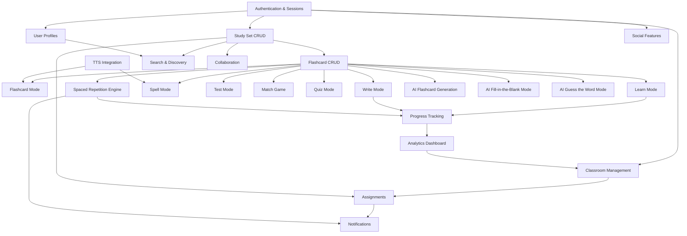
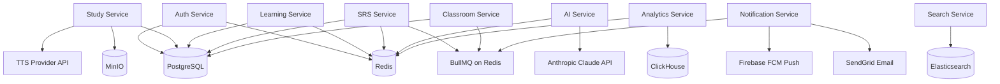
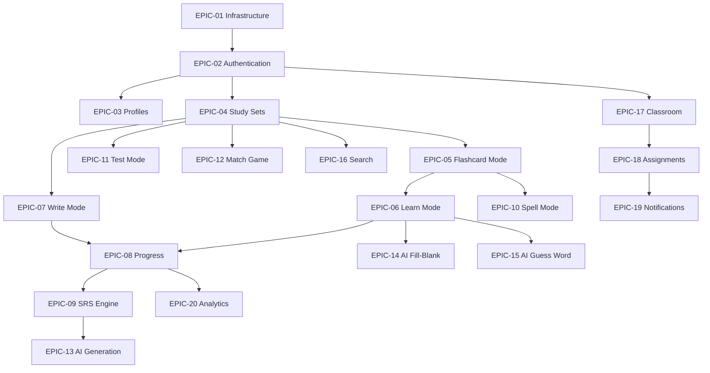
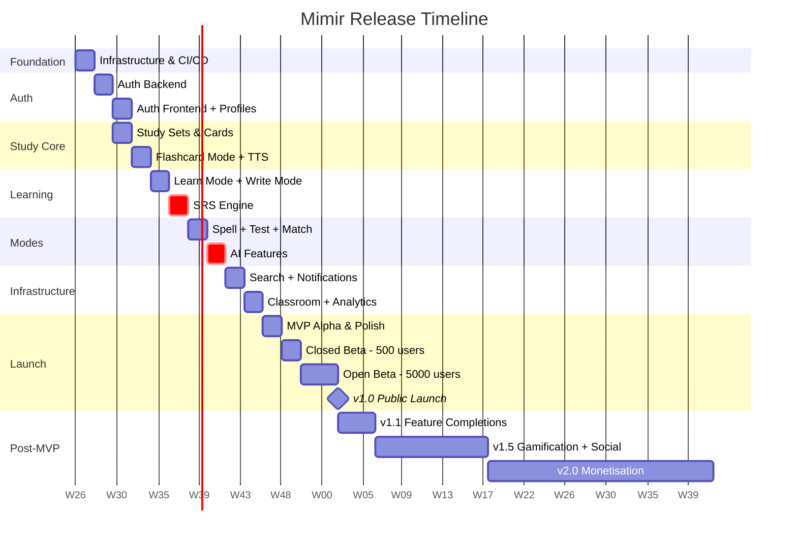

# Mimir — Development Roadmap & Release Plan

> **Version:** 1.0.0 | **Based On:** Mimir SRS v1.0 + TDD v1.0 | **Status:** For Review — Engineering & Product
> **Team:** 6 Engineers (3 BE, 2 FE, 1 DevOps) | **MVP Target:** Q4 2026 (~24 weeks from kick-off)

---

## Table of Contents

1. [Project Overview](#1-project-overview)
2. [Dependency Analysis](#2-dependency-analysis)
3. [MVP Definition](#3-mvp-definition)
4. [Release Strategy](#4-release-strategy)
5. [Development Phases](#5-development-phases)
6. [Engineering Epics](#6-engineering-epics)
7. [Sprint Planning](#7-sprint-planning)
8. [Risk Register](#8-risk-register)
9. [Team Structure & Resource Planning](#9-team-structure--resource-planning)
10. [Milestones](#10-milestones)
11. [Launch Strategy](#11-launch-strategy)
12. [Success Metrics](#12-success-metrics)
13. [Final Recommended Build Order](#13-final-recommended-build-order)

---

## 1. Project Overview

### 1.1 Product Summary

Mimir is an AI-powered vocabulary learning platform designed to help students, self-directed learners, and teachers master vocabulary through scientifically proven techniques — spaced repetition, active recall, and contextual AI-generated learning content. The platform delivers multiple study modes, a classroom management suite, and three AI-powered learning features in its first release.

### 1.2 Product Goals

- Deliver the fastest path to vocabulary mastery for learners at all levels.
- Provide teachers with a zero-friction tool for assigning, tracking, and analysing student vocabulary progress.
- Generate high-quality study content in seconds using AI, eliminating the biggest barrier to starting a study set.
- Build a habit-forming daily study loop through spaced repetition and well-timed reminders.

### 1.3 Technical Goals

- Deliver a production-ready platform capable of serving 100,000 concurrent users by v1.0 launch.
- Maintain p95 API response time < 300 ms under normal load from day one.
- Achieve 99.9% uptime SLA through Kubernetes-managed deployment with rolling updates.
- Establish a CI/CD pipeline that allows safe same-day deployments with automated rollback.
- Build on a clean service boundary architecture that supports Phase 2 scale without breaking changes.

### 1.4 Business Goals

- Reach 50,000 registered users within 3 months of public launch.
- Achieve Day-30 user retention above 20% from launch.
- Onboard 500 teacher accounts within 6 months — teachers are the highest-retention acquisition channel.
- Establish the data and infrastructure foundation for a premium subscription tier (Phase 2).

### 1.5 MVP Vision

> **The Mimir MVP** is the smallest cohesive product that delivers the core value proposition: a user can create a vocabulary study set, study it through multiple modes, receive a personalised AI-powered learning experience, and see their retention improve over time via spaced repetition.
>
> A teacher can create a class, assign a set with a deadline, and monitor student mastery — all without leaving Mimir.
>
> The MVP is **NOT** feature-complete. Gamification, premium subscriptions, content moderation tooling, mobile apps, and social features are explicitly deferred to Phase 2 and beyond.

### 1.6 Team & Resources

| Role | Count | Primary Responsibilities | Sprint Assignment |
|---|---|---|---|
| Backend Engineer | 3 | NestJS services, Prisma, SRS algorithm, AI/TTS integration, BullMQ | All phases |
| Frontend Engineer | 2 | React SPA, study mode UIs, API integration, design system | Phases 2+ |
| DevOps / Platform Engineer | 1 | Docker, Kubernetes, CI/CD, monitoring, MinIO, Elasticsearch | Phase 1 + ongoing |
| Product Designer | 1 (part-time) | UI/UX wireframes, design system, user testing | Phases 1–3 |

---

## 2. Dependency Analysis

Before planning sprints, all feature and infrastructure dependencies must be mapped. A feature cannot be built before its upstream dependencies are stable. The following analysis drives the build order in Section 13.

### 2.1 Feature Dependency Tree

Features are connected by hard dependencies (must exist before) and soft dependencies (greatly enhanced by). The graph below shows hard dependencies only.

### 2.2 Infrastructure Dependency Tree

### 2.3 Service Build Order Dependencies

| Service | Hard Dependencies | Soft Dependencies | Can Be Built In Parallel With |
|---|---|---|---|
| Auth Service | PostgreSQL, Redis | — | DevOps setup |
| Study Service | PostgreSQL, MinIO, Auth Service | Elasticsearch (search) | SRS Service |
| Learning Service | PostgreSQL, Redis, Study Service | AI Service, SRS Service | Notification Service |
| SRS Service | PostgreSQL, Redis, Learning Service | BullMQ | AI Service |
| AI Service | Anthropic API key, Redis | — | SRS Service, TTS setup |
| Classroom Service | PostgreSQL, Auth Service, Study Service | BullMQ, Notification Service | Search Service |
| Search Service | Elasticsearch, Study Service | — | Classroom Service |
| Notification Service | Redis, BullMQ, SendGrid, FCM | — | Search Service |
| Analytics Service | ClickHouse, BullMQ | — | After Learning Service is stable |

### 2.4 Critical Path

> **The longest dependency chain — and therefore the critical path — is:**
>
> Infrastructure → Auth → Study Sets → Flashcards → Learn Mode → SRS Engine → AI Features → Classroom → Analytics → **MVP**
>
> Any delay on this chain directly delays the MVP. Search, Notifications, and Social features are on parallel tracks and will not gate the MVP if delayed by 1–2 sprints.

### 2.5 Risk Dependencies

| Dependency | Risk | Mitigation |
|---|---|---|
| Anthropic Claude API | Rate limits or pricing changes could impact AI features cost model. | Implement rate limiting on day one. Abstract provider behind interface for easy swap. |
| TTS Provider API | Provider outage silently breaks Spell Mode and audio buttons. | Graceful fallback: disable TTS button with clear UI state; study session continues uninterrupted. |
| Elasticsearch setup | Complex initial config; risk of wrong mapping requiring full re-index. | Validate mapping against real data samples in Sprint 1 before production use. |
| ClickHouse analytics | Low-priority for MVP; risk of delaying other features if complex. | Stub analytics events in BullMQ; ClickHouse consumer built in Sprint 11 (non-blocking). |
| MinIO availability | Export jobs fail if MinIO is down. | BullMQ retry policy; exports are async; user notified on failure. |

---

## 3. MVP Definition

The MVP scope is determined by applying three filters to every feature: (1) Does it block the core learning loop? (2) Does it block the teacher classroom workflow? (3) Is its complexity justified at this stage?

> **Effort codes:** S = Small (1–3 dev-days) · M = Medium (3–7 dev-days) · L = Large (7–14 dev-days) · XL = Extra Large (14+ dev-days)

| Feature | MVP? | Reasoning | Business Value | Effort |
|---|---|---|---|---|
| **Authentication** | | | | |
| Email + Password Registration | ✓ YES | Cannot use the platform without it. | Critical | S |
| Email Verification | ✓ YES | Required for GDPR and trust. | High | S |
| Login + JWT Sessions | ✓ YES | Core auth flow. | Critical | S |
| Password Reset | ✓ YES | Essential UX — users forget passwords. | High | S |
| Google OAuth | ✓ YES | Reduces signup friction significantly. | High | M |
| Apple OAuth | ◑ PART | Required for iOS but iOS app is Phase 2. Include backend, skip iOS UI. | Medium | S |
| Two-Factor Authentication | ✗ NO | Low risk for MVP users. Added in v1.5. | Low | M |
| **Profiles** | | | | |
| User Profile Page | ✓ YES | Basic: name, avatar, bio. | High | S |
| Learning Stats on Profile | ◑ PART | Show totals; full heatmap in v1.1. | Medium | M |
| **Study Sets & Cards** | | | | |
| Create / Edit / Delete Study Set | ✓ YES | Core product. Without this nothing else works. | Critical | M |
| Add / Edit / Delete Cards | ✓ YES | Core product. | Critical | M |
| Import Cards from CSV | ✓ YES | High adoption driver. Saves hours of manual entry. | High | M |
| Export Set (CSV) | ✓ YES | Basic export; builds trust with power users. | High | S |
| Export Set (PDF / Anki) | ✗ NO | Nice to have; defer to v1.1. | Medium | M |
| Set Visibility (Private / Public) | ✓ YES | Needed for social discovery from day one. | High | S |
| Version History | ✗ NO | Complexity not justified in MVP. | Low | L |
| Collaborative Editing | ✗ NO | Phase 1.5 — needs conflict resolution logic. | Medium | L |
| Folders & Organisation | ✓ YES | Users need basic organisation from launch. | Medium | M |
| **Study Modes** | | | | |
| Flashcard Mode | ✓ YES | Simplest mode; core product experience. | Critical | M |
| Learn Mode | ✓ YES | Primary adaptive learning mode; core value prop. | Critical | L |
| Write Mode | ✓ YES | Active recall — essential for retention. | Critical | M |
| Spell Mode | ✓ YES | Differentiator for language learners. | High | M |
| Test Mode | ✓ YES | High teacher demand for assessments. | High | L |
| Match Game | ✓ YES | Engagement/fun; low dev cost. | Medium | M |
| Quiz Mode (custom builder) | ✗ NO | Adds significant scope. Defer to v1.1. | Medium | L |
| **Spaced Repetition** | | | | |
| Spaced Repetition (SM-2) | ✓ YES | Core differentiator. What makes Mimir better. | Critical | L |
| Daily SRS Queue | ✓ YES | Entry point to the daily habit loop. | Critical | M |
| 30-Day Forecast | ✗ NO | Nice to have. Adds complexity. v1.1. | Low | M |
| Leech Detection | ✓ YES | Easy to add; prevents frustration with stuck cards. | Medium | S |
| **AI Features** | | | | |
| AI Flashcard Generation | ✓ YES | Biggest adoption hook. Removes #1 friction point. | Critical | L |
| AI Fill-in-the-Blank Mode | ✓ YES | Core unique learning mode differentiating Mimir. | High | L |
| AI Guess the Word Mode | ✓ YES | Core unique learning mode. Part of v1 identity. | High | L |
| **Audio** | | | | |
| TTS Pronunciation (API) | ✓ YES | Essential for language learners. Core use case. | Critical | M |
| Pronunciation Recording & Feedback | ✗ NO | Complex; high AI cost. Phase 2. | Medium | XL |
| **Search** | | | | |
| Full-Text Search | ✓ YES | Users cannot discover public sets without it. | High | M |
| Search Filters (language, category) | ✓ YES | Essential for relevant discovery results. | High | M |
| Autocomplete Suggestions | ✗ NO | Enhances UX but not blocking. v1.1. | Medium | M |
| **Classroom** | | | | |
| Create Class + Join Code | ✓ YES | Core teacher feature. High-retention channel. | Critical | M |
| Assign Study Sets | ✓ YES | Primary teacher workflow. | Critical | M |
| Assignment Due Dates | ✓ YES | Required for classroom workflow. | High | S |
| View Student Progress | ✓ YES | Primary teacher value — cannot defer. | Critical | M |
| Export Class Reports (PDF/CSV) | ✗ NO | Useful but not blocking. v1.1. | Medium | M |
| **Notifications** | | | | |
| Email: Assignment Notifications | ✓ YES | Required for classroom feature. | High | M |
| Email: Weekly Summary | ✗ NO | Engagement driver but not MVP-critical. | Low | M |
| Push Notifications | ✗ NO | Mobile-first; web app is MVP focus. v1.1. | Medium | L |
| SRS Study Reminders | ◑ PART | Email only in MVP. Push in v1.1. | Medium | M |
| **Analytics** | | | | |
| Student Progress Dashboard | ✓ YES | Required to show value of studying on Mimir. | High | M |
| Teacher Class Analytics | ✓ YES | Required for classroom feature value. | High | M |
| Platform Admin Analytics | ✗ NO | Internal tool; not user-facing. v1.1. | Low | M |
| **Social** | | | | |
| Like / Save Public Sets | ✓ YES | Needed for public set discovery loop. | Medium | S |
| Follow Users | ✗ NO | Not needed for core learning experience. v1.5. | Low | M |
| Activity Feed | ✗ NO | Phase 2 social layer. | Low | L |
| Comments on Sets | ✗ NO | Phase 2. Low learning value. | Low | M |
| **Gamification** | | | | |
| XP / Levels / Badges | ✗ NO | Phase 2. Engagement but not core value. | Low | L |
| Streaks | ✗ NO | Phase 2. High value but complex to do well. | Medium | M |
| Leaderboards | ✗ NO | Phase 2. | Low | M |

### 3.1 MVP Scope Summary

| Category | In MVP | Deferred | Notes |
|---|---|---|---|
| Authentication | 4 / 6 | 2 (2FA, Apple UI) | Backend Apple auth ready; iOS UI Phase 2 |
| Study Sets & Cards | 6 / 8 | 2 (Version History, Collab) | Core CRUD fully in MVP |
| Study Modes | 6 / 7 | 1 (Custom Quiz Builder) | All core modes included |
| Spaced Repetition | 3 / 4 | 1 (Forecast chart) | SM-2 engine fully in MVP |
| AI Features | 3 / 3 | 0 | All 3 AI modes in MVP — core differentiators |
| Audio / TTS | 1 / 2 | 1 (Recording) | TTS in MVP; recording is Phase 2 |
| Search | 2 / 3 | 1 (Autocomplete) | Basic search and filters in MVP |
| Classroom | 4 / 5 | 1 (Report Export) | Core classroom loop in MVP |
| Notifications | 2 / 4 | 2 (Push, Weekly Email) | Assignment email + SRS email in MVP |
| Analytics | 2 / 3 | 1 (Admin Dashboard) | Student + teacher dashboards in MVP |
| Social | 1 / 5 | 4 (Follow, Feed, Comments…) | Like/Save only in MVP |
| Gamification | 0 / 3 | 3 (all) | Fully deferred to Phase 2 |

---

## 4. Release Strategy

Mimir follows a staged release strategy: each version builds on the validated foundation of the previous one. Revenue (Premium) is deferred until the product has proven retention — charging too early is a growth killer for vocabulary apps.

### 4.1 Version 1.0 — Public MVP (Target: Month 6)

| Attribute | Detail |
|---|---|
| **Scope** | Auth, Sets, Cards, Flashcard/Learn/Write/Spell/Test/Match modes, SRS, AI (3 features), TTS, Search, Classroom (core), Notifications (email), Student & Teacher analytics, Like/Save social. |
| **Not Included** | Gamification, Premium subscription, Content moderation tooling, Image support, Push notifications, Custom quiz builder, Version history, Collaboration editing, Mobile apps. |
| **Primary Audience** | Students (K-12, university), self-directed language learners, language teachers. |
| **Distribution** | Invite-only open beta → public sign-up. |
| **Expected Outcome** | 10,000 registered users in first 30 days. Initial teacher adoption cohort of 100 classrooms. |

**v1.0 Success Metrics**

| KPI | Target at Day 30 | Target at Day 90 |
|---|---|---|
| Registered Users | 10,000 | 40,000 |
| Daily Active Users | 1,500 | 8,000 |
| Day-7 Retention | 30% | 35% |
| Day-30 Retention | 15% | 22% |
| Study Sets Created | 20,000 | 100,000 |
| AI Flashcard Generations / Day | 500 | 3,000 |
| Teacher Accounts | 100 | 500 |
| P95 API Response Time | < 300 ms | < 300 ms |

### 4.2 Version 1.1 — Polish & Completion (Target: Month 8)

| Attribute | Detail |
|---|---|
| **Scope** | Autocomplete search, Custom Quiz builder, Export (PDF + Anki), Push notifications (web), SRS 30-day forecast, Admin analytics dashboard, Profile heatmap, Email weekly summary. |
| **Objective** | Complete the study experience; give users more control over their progress; enable teachers to export grades. |
| **Expected Outcome** | Improved Day-30 retention (+5 pp). Teacher NPS improvement from report exports. |

### 4.3 Version 1.5 — Engagement Layer (Target: Month 12)

| Attribute | Detail |
|---|---|
| **Scope** | Gamification (XP, levels, daily streak, streak freeze, badges, weekly leaderboard), Social features (follow, activity feed, comments on sets), Collaborative set editing, Version history, Bulk class import for teachers. |
| **Objective** | Build habit and community. Users who maintain a 7-day streak have 3× the Day-90 retention of those who do not. |
| **Expected Outcome** | DAU/MAU ratio increases from 15% → 22%. Average sessions per user per week increases to 4.5. |

### 4.4 Version 2.0 — Monetisation (Target: Month 18)

| Attribute | Detail |
|---|---|
| **Scope** | Premium subscription tier (Stripe billing, 14-day trial), Content Moderation tooling (Moderator role, auto-classifier, report queue), advanced AI features (tutor chat, study plans, pronunciation feedback), offline mode (PWA), image support in cards. |
| **Objective** | Activate revenue. Premium is delayed until v2.0 because (a) the product must have proven 90-day retention to justify charging, and (b) content moderation is required before scaling to paid users. |
| **Expected Outcome** | $15,000 MRR in first month. 3.5% free-to-premium conversion. |

### 4.5 Version 3.0 — Platform & Scale (Target: Month 24)

| Attribute | Detail |
|---|---|
| **Scope** | Native iOS + Android apps, Content marketplace, Corporate learning tier (B2B), LMS integration (Canvas/Moodle LTI 1.3), OCR/PDF import. |
| **Objective** | Expand addressable market beyond web users. Unlock institutional (B2B) revenue (10× ARPU of individual users). |
| **Expected Outcome** | $100K MRR. Mobile apps drive 40% of DAU. First 5 institutional contracts signed. |

---

## 5. Development Phases

Development is broken into 10 sequential phases. Each phase has clear entry criteria (what must be true before it starts) and exit criteria (what must be true before the next phase begins). Phases overlap — frontend work lags backend by roughly one sprint.

### Phase 1: Foundation & Infrastructure (Weeks 1–2)

| | |
|---|---|
| **Objectives** | Establish all three repositories. Get infrastructure running locally and in CI. Set the engineering foundation that every subsequent phase depends on. |
| **Deliverables** | Three repos (mimir-backend, mimir-web, mimir-mobile) with base structure. Docker Compose local dev stack (PostgreSQL, Redis, Elasticsearch, MinIO, ClickHouse). GitHub Actions CI skeletons. Kubernetes base manifests. Prisma schema baseline. Health check endpoints on all services. Grafana + Prometheus monitoring scaffolding. |
| **Dependencies** | Cloud environment provisioned. DNS configured. Container registry access. |
| **Risks** | Elasticsearch and ClickHouse configuration complexity may extend timeline by 2–3 days. |
| **Exit Criteria** | All services start locally via `docker compose up`. CI pipeline passes on all three repos. Database migrations apply cleanly. Health endpoints return 200. |

### Phase 2: Authentication & User Management (Weeks 3–6)

| | |
|---|---|
| **Objectives** | Implement complete authentication system. Users can register, verify email, log in, reset password, and use Google OAuth. JWT session management is production-ready. |
| **Deliverables** | Auth Service: register, login, refresh, logout, password reset, email verify, Google OAuth. User profile CRUD. Frontend: login, register, forgot-password pages. React auth context with token storage and auto-refresh. |
| **Dependencies** | Phase 1 complete. SendGrid API key configured. Google OAuth credentials. |
| **Risks** | OAuth edge cases (duplicate email across providers) are a common bug source. Allocate extra time. |
| **Exit Criteria** | A user can register, verify email, log in via email/password AND Google, reset their password, and update their profile — all without manual DB intervention. |

### Phase 3: Study Set & Card Management (Weeks 5–8)

| | |
|---|---|
| **Objectives** | Users can create, edit, and organise study sets and cards. CSV import and folder organisation work correctly. |
| **Deliverables** | Study Service: set CRUD, card CRUD, visibility, CSV import, folder management. Frontend: set editor, card editor, folder view, import modal. |
| **Dependencies** | Phase 2 (Auth) must be complete for ownership enforcement. |
| **Risks** | CSV import edge cases (encoding, empty rows, duplicate terms). Invest in robust parser with user-facing error messages. |
| **Exit Criteria** | User can create a 50-card set via UI. User can import a 200-card CSV. Folders organise sets correctly. Public/private visibility enforced. |

### Phase 4: Flashcard Mode & TTS (Weeks 7–10)

| | |
|---|---|
| **Objectives** | Deliver the first complete study experience: Flashcard Mode with TTS audio. This is the first time the product feels real. |
| **Deliverables** | Flashcard study session: flip animation, shuffle, star cards, Know It/Still Learning. TTS Controller: proxy to Google TTS, rate limiting, browser cache headers. Full-screen flashcard UI with keyboard shortcuts. |
| **Dependencies** | Phase 3 (Study Sets) complete. TTS provider API key configured. |
| **Risks** | TTS API cold start latency may feel sluggish. Test caching strategy early. |
| **Exit Criteria** | User can study a 50-card set in Flashcard Mode. Speaker button plays correct pronunciation within 1 second. |

### Phase 5: Learn Mode, Write Mode & Progress Tracking (Weeks 9–12)

| | |
|---|---|
| **Objectives** | Deliver the two highest-value active recall modes. Establish the session model and progress tracking infrastructure that SRS will build on. |
| **Deliverables** | Learning Service: session state machine, confidence scoring, answer evaluation (exact + partial match + Levenshtein), Learn Mode card selection algorithm. Write Mode with diff display and hints. Progress tracking: per-set mastery, accuracy, session history. |
| **Dependencies** | Phase 4 (Flashcard Mode) session infrastructure in place. |
| **Risks** | Answer evaluation edge cases for multi-word answers, punctuation, and language-specific characters. |
| **Exit Criteria** | User can complete a 20-card Learn Mode session and see mastery % update. Write Mode evaluates typos correctly. |

### Phase 6: Spaced Repetition Engine (Weeks 11–14)

| | |
|---|---|
| **Objectives** | Implement the SM-2 algorithm, daily review queue, and SRS card lifecycle. This is the most technically complex and highest-value component of the platform. |
| **Deliverables** | SRS Service: SM-2 `processReview()`, daily queue logic (overdue/due/new prioritisation), SrsCard creation on set completion, leech detection, nightly BullMQ cron. SRS dashboard widget and review session UI. |
| **Dependencies** | Phase 5 (session model and progress tracking) complete. |
| **Risks** | SM-2 parameter tuning requires real usage data. Launch with defaults; plan data-driven tuning after first 1,000 users. |
| **Exit Criteria** | SM-2 unit tests pass all algorithm edge cases. User can work through a 30-card SRS queue and see next-review dates update correctly. |

### Phase 7: Remaining Study Modes (Weeks 13–16)

| | |
|---|---|
| **Objectives** | Complete the full study mode suite: Spell Mode, Test Mode, and Match Game. |
| **Deliverables** | Spell Mode (TTS + typed answer + accuracy tracking). Test Mode (auto-generated multi-type tests, timer, results). Match Game (drag-and-drop grid, time tracking). |
| **Dependencies** | Phase 4 (TTS) and Phase 5 (answer evaluation logic) complete. |
| **Risks** | Test Mode distractor generation quality. Use other cards in the set as distractors; fallback to True/False format when fewer than 4 cards available. |
| **Exit Criteria** | All three modes fully playable. Test Mode generates valid assessments for any 10+ card set. |

### Phase 8: AI Learning Features (Weeks 15–18)

| | |
|---|---|
| **Objectives** | Implement all three Phase 1 AI features: Flashcard Generation, Fill-in-the-Blank Mode, and Guess the Word Mode. |
| **Deliverables** | AI Service: AnthropicService client, flashcard generation with streaming, fill-blank sentence generation, guess-word description generation, per-user daily rate limiter. Streaming card preview UI, AI mode selector, both AI study mode UIs. |
| **Dependencies** | Phase 6 (study session model). Anthropic API key configured. |
| **Risks** | Prompt reliability — Claude responses may not always parse as valid JSON. Implement retry logic (up to 2 retries) and robust JSON extraction. |
| **Exit Criteria** | User can generate 20 flashcards from a topic in < 8 seconds. Fill-in-Blank mode produces grammatically correct sentences for 95%+ of test terms. Guess-Word descriptions do not contain the target word. |

### Phase 9: Search & Discovery (Weeks 17–19)

| | |
|---|---|
| **Objectives** | Users can discover public study sets through full-text search with language and category filters. |
| **Deliverables** | Search Service: Elasticsearch index setup (mimir_sets), BullMQ sync consumer, search endpoint with filters. Search page with filter sidebar and result cards. |
| **Dependencies** | Elasticsearch running (Phase 1). Study Service publishing BullMQ sync events (Phase 3). |
| **Risks** | Elasticsearch mapping migration if fields change post-launch. Design mapping carefully in Phase 1; avoid post-launch changes. |
| **Exit Criteria** | Search returns relevant results in < 300 ms. Filters correctly narrow results by language and category. |

### Phase 10: Classroom, Notifications & Analytics (Weeks 18–22)

| | |
|---|---|
| **Objectives** | Deliver the complete classroom workflow, email notification system, and analytics dashboards. |
| **Deliverables** | Classroom Service: class CRUD, join code, assignments, at-risk detection. BullMQ workers for assignment email, SRS reminder, and at-risk teacher alert. Student analytics dashboard. Teacher class analytics page. ClickHouse analytics consumer. |
| **Dependencies** | Phases 3, 6, and 9 stable. SendGrid API key configured. |
| **Risks** | At-risk detection logic requires tuning. Start conservative (48 h before deadline, not started). |
| **Exit Criteria** | Full classroom cycle works end-to-end. Students receive assignment email within 2 minutes. Teacher analytics show accurate data. |

---

## 6. Engineering Epics

Epics group related user stories into meaningful units of work. Effort is in engineering dev-days for the 6-person team.

| Epic | Priority | Phase | Effort (Dev-Days) | Complexity | Key Dependencies |
|---|---|---|---|---|---|
| EPIC-01: Infrastructure & DevOps | P0 | 1 | 8 | High | Cloud environment |
| EPIC-02: Authentication & Identity | P0 | 2 | 10 | Medium | PostgreSQL, Redis, SendGrid |
| EPIC-03: User Profiles | P0 | 2 | 5 | Low | Auth (EPIC-02) |
| EPIC-04: Study Set Management | P0 | 3 | 12 | Medium | Auth (EPIC-02) |
| EPIC-05: Flashcard Mode & TTS | P0 | 4 | 8 | Medium | Sets (EPIC-04), TTS API |
| EPIC-06: Learn Mode | P0 | 5 | 10 | High | Sets (EPIC-04) |
| EPIC-07: Write Mode | P0 | 5 | 6 | Medium | Sets (EPIC-04) |
| EPIC-08: Progress Tracking | P0 | 5 | 6 | Medium | Learn/Write modes |
| EPIC-09: SRS Engine | P0 | 6 | 14 | High | Progress (EPIC-08) |
| EPIC-10: Spell Mode | P1 | 7 | 5 | Low | TTS (EPIC-05) |
| EPIC-11: Test Mode | P1 | 7 | 8 | Medium | Cards (EPIC-04) |
| EPIC-12: Match Game | P1 | 7 | 4 | Low | Cards (EPIC-04) |
| EPIC-13: AI Flashcard Generation | P0 | 8 | 10 | High | Anthropic API, Redis |
| EPIC-14: AI Fill-in-the-Blank Mode | P0 | 8 | 8 | High | Sessions (EPIC-06) |
| EPIC-15: AI Guess the Word Mode | P0 | 8 | 8 | High | Sessions (EPIC-06) |
| EPIC-16: Search & Discovery | P1 | 9 | 10 | Medium | Elasticsearch, Sets |
| EPIC-17: Classroom Management | P0 | 10 | 8 | Medium | Auth, Sets |
| EPIC-18: Assignments | P0 | 10 | 10 | Medium | Classroom (EPIC-17) |
| EPIC-19: Notification Service | P1 | 10 | 8 | Medium | BullMQ, SendGrid |
| EPIC-20: Analytics Dashboards | P1 | 10 | 10 | Medium | Progress (EPIC-08), ClickHouse |
| EPIC-21: Social (Like/Save) | P2 | MVP-Polish | 3 | Low | Auth, Sets |
| EPIC-22: Security Hardening | P0 | All phases | 4 | Medium | All services |

### 6.1 Epic Dependency Map

---

## 7. Sprint Planning

Sprints 1–12 cover the MVP build (Weeks 1–24). Sprints 13–20 are summarised in a table.

> **Velocity assumption:** ~30 story points per sprint across the full team. S=1 pt, M=3 pt, L=5 pt, XL=8 pt.

---

### Sprint 1 — Weeks 1–2: Foundation & Infrastructure

**Goal:** All three repos initialised, local dev running, CI green.

**Technical Tasks**
- Create `mimir-backend`, `mimir-web`, `mimir-mobile` GitHub repos with base structure and branch protection.
- Write `docker-compose.yml` with PostgreSQL, Redis, Elasticsearch, MinIO, ClickHouse.
- Write Prisma schema baseline: `users`, `study_sets`, `flashcards` tables.
- Run `prisma migrate dev`; verify schema applies cleanly.
- Create NestJS app skeletons for all 9 services — each with `/health` endpoint.
- Set up GitHub Actions: lint + unit test + docker build pipelines per repo.
- Configure Kubernetes base manifests and Helm chart skeleton.
- Set up Prometheus + Grafana + Loki monitoring stack.
- Create mimir-web Vite + React + Tailwind scaffold with routing skeleton.
- Write OpenAPI type generation script (`scripts/generate-api-types.sh`).

**Deliverables**
- All three repos exist and CI is green.
- Local dev stack runs via `docker compose up`.
- All services respond 200 on `/health`.
- Grafana dashboard shows service health.

**Key Risk:** Elasticsearch and ClickHouse configuration may take longer than estimated. Parallelise: DevOps configures Elasticsearch while BE engineers set up service skeletons.

**Definition of Done:** All services start. CI passes. `docker compose up` brings all dependencies online. Migrations apply. Health checks green.

---

### Sprint 2 — Weeks 3–4: Authentication Backend

**Goal:** Full Auth Service implemented and tested.

**User Stories**
- US-001: As a learner, I can register with email and password.
- US-002: As a learner, I can log in with my Google account.
- US-003: As a learner, I can reset a forgotten password.

**Technical Tasks**
- Implement `/auth/register` with bcrypt password hashing and email verification job (BullMQ → SendGrid).
- Implement `/auth/login` with JWT RS256 access token (15 m) + refresh token (30 d, HttpOnly cookie).
- Implement `/auth/refresh` with rotating refresh token pattern.
- Implement `/auth/password/reset-request` and `/auth/password/reset`.
- Implement `/auth/verify-email`.
- Implement Google OAuth 2.0 strategy (`passport-google-oauth20`).
- Write full unit test suite for JWT strategy and auth service.
- Implement rate limiting: 5 failed login attempts → 15-minute lockout.
- Implement ThrottlerModule globally; override login endpoint limit.

**Deliverables**
- Auth Service fully functional. All endpoints pass integration tests.
- Email verification working with SendGrid.
- JWT + refresh token flow working end-to-end.

**Key Risk:** OAuth "duplicate email across providers" edge case — test: register via email, then log in via Google with same email; should link, not create duplicate.

**Definition of Done:** All auth endpoints pass integration tests. Email verification works in staging. Tokens expire and refresh correctly.

---

### Sprint 3 — Weeks 5–6: Auth Frontend + User Profiles

**Goal:** Users can register, log in, and manage their profile from the browser.

**User Stories**
- US-001: As a learner, I can register via a clean form.
- US-002: As a learner, I can log in with Google from the sign-in page.

**Technical Tasks**
- Build Login and Register pages in mimir-web with form validation.
- Implement React auth context: access token in memory, refresh on 401.
- Build Google OAuth button with redirect flow.
- Build forgot-password and reset-password pages.
- Implement `/users/me` PATCH and `/users/:username` GET.
- Build profile page: display name, avatar upload to MinIO, bio.
- Write Playwright E2E: Register → Verify → Login → View Profile.

**Deliverables**
- Users can register, log in, and update their profile via the UI.
- Avatar uploads to MinIO and displays correctly.
- Playwright auth E2E test passes.

**Key Risk:** Avatar upload depends on MinIO. If blocked, use URL-based avatar (Gravatar) as fallback and add file upload in Sprint 4.

**Definition of Done:** Full registration + login + profile update flow works from the browser without errors.

---

### Sprint 4 — Weeks 7–8: Study Sets & Cards

**Goal:** Full study set and card CRUD with CSV import and folder organisation.

**User Stories**
- US-004: As a learner, I can create a study set with a title and language.
- US-005: As a learner, I can add a term, definition, and example sentence.
- US-006: As a learner, I can import 100 terms from a CSV file.

**Technical Tasks**
- Implement Study Service: `/sets` CRUD, `/sets/:id/cards` CRUD, visibility toggle, folder management.
- Implement CSV import endpoint with field-mapping preview and error display.
- Implement card fields: term, definition, example, phonetic, notes, synonyms, translations.
- Add set/card to Elasticsearch index via BullMQ sync job.
- Build Set Editor in mimir-web: title/language form, card list with inline editing.
- Build CSV Import modal with field mapping preview.
- Build Folder view with drag-and-drop set organisation.

**Deliverables**
- Full set CRUD from the browser. CSV import works for real-world vocabulary files.
- Sets sync to Elasticsearch. Folders organise sets correctly.

**Key Risk:** CSV import encoding edge cases (UTF-8 BOM, Windows line endings, commas in quoted fields). Use a battle-tested parser (PapaParse on frontend, `csv-parse` on backend).

**Definition of Done:** User can create a 50-card set via UI and import a 200-card CSV. Elasticsearch returns the set in search results within 5 seconds of creation.

---

### Sprint 5 — Weeks 9–10: Flashcard Mode + TTS

**Goal:** First complete study experience — Flashcard Mode with TTS pronunciation.

**User Stories**
- US-010: As a learner, I can study with flashcards.
- US-011: As a learner, I can hear the pronunciation of any term.
- US-012: As a learner, I can slow down audio playback to 0.5×.

**Technical Tasks**
- Build Learning Service: `POST /sessions`, `POST /sessions/:id/answer`, `POST /sessions/:id/complete`.
- Implement TTS Controller in Study Service: `GET /tts?term=&language=&speed=` proxying Google TTS. Add Redis rate limiter (200 calls / 30 m per user).
- Build Flashcard Mode UI: full-screen card with 3D flip animation (CSS), shuffle, Star / Know It / Still Learning.
- Build `AudioButton` component using `useTts` hook.
- Add keyboard navigation: spacebar flip, left/right arrows.
- Build session complete screen with basic accuracy stats.

**Deliverables**
- Flashcard Mode fully playable end-to-end.
- TTS plays correct pronunciation within 1 second.
- Session results persisted to DB.

**Key Risk:** TTS cold start — first request can take 2–3 s. Implement a brief loading state on the AudioButton; do not block card flip.

**Definition of Done:** User can study a 20-card set in Flashcard Mode without errors. TTS audio plays. Playwright E2E test passes.

---

### Sprint 6 — Weeks 11–12: Learn Mode + Write Mode

**Goal:** Primary adaptive learning and active recall modes with progress tracking.

**User Stories**
- US-013: As a learner, I can use Learn Mode to progressively master all cards.
- US-014: As a learner, I can type my answers in Write Mode.

**Technical Tasks**
- Implement Learn Mode algorithm: batch of 7–10 cards, mixed MC/written, confidence scoring, mastery threshold 0.85+.
- Implement Write Mode evaluation: exact match, case-insensitive, Levenshtein distance ≤ 1 for 6+ char words, partial credit.
- Build Write Mode frontend: text input, diff display on wrong answer, hint button (reveals first letter).
- Build Learn Mode frontend: MC buttons, text input for written questions, mastery progress bar.
- Implement progress tracking: mastery per set, accuracy rate, session history.
- Write unit tests for Levenshtein evaluation and confidence scoring.

**Deliverables**
- Learn Mode session completes; mastery % updates.
- Write Mode evaluates with typo tolerance.
- Progress data persisted and visible on set page.

**Key Risk:** MC distractor generation for sets with < 4 cards. Handle gracefully with written-only fallback.

**Definition of Done:** User can complete a 20-card Learn Mode session. Mastery % updates. Write Mode correctly awards partial credit for near-correct answers.

---

### Sprint 7 — Weeks 13–14: Spaced Repetition Engine

**Goal:** SM-2 algorithm, daily review queue, and nightly SRS reminders.

**User Stories**
- US-018: As a learner, I can see my daily SRS review queue.
- US-019: As a learner, I can rate my recall after each SRS review.
- US-049: As a learner, cards I keep forgetting are flagged as leeches.

**Technical Tasks**
- Implement `sm2.processReview()` with full unit test suite (10+ test cases).
- Implement SRS card bootstrapping: when Learn Mode completes at ≥ 80% mastery, create `SrsCard` rows for all cards.
- Implement `getDailyQueue()`: overdue (60%) → due today (30%) → new (10% of daily limit).
- Implement leech detection: `isLeech = true` after 7 lapses.
- Set up nightly BullMQ cron: find users with due cards, enqueue SRS-reminder emails.
- Build SRS Dashboard widget: card count, estimated time, Start Review button.
- Build SRS review session UI: rate cards (Again/Hard/Good/Easy) → completion screen.

**Deliverables**
- SRS queue populated after Learn Mode completion.
- Ratings correctly update SM-2 state.
- Leech detection working. Nightly reminder email sent.

**Key Risk:** SM-2 interval arithmetic with Prisma `Decimal` type — JavaScript number precision. Use `Number()` casts carefully; add rounding assertions to tests.

**Definition of Done:** Unit tests pass all SM-2 edge cases. Integration test confirms intervals grow over 10 simulated days. User can work through a 30-card SRS queue.

---

### Sprint 8 — Weeks 15–16: Spell Mode + Test Mode + Match Game

**Goal:** Complete the full study mode suite.

**User Stories**
- US-015: As a learner, I can practise spelling in Spell Mode.
- US-016: As a learner, I can take a Test to assess my full knowledge.
- US-017: As a learner, I can play the Match Game.

**Technical Tasks**
- Implement Spell Mode: TTS playback, typed answer evaluation with tolerance, speed controls.
- Implement Test Mode auto-generator: MC, matching, written, true/false from set cards.
- Implement test result saving: per-question analysis, time-per-question, retake tracking.
- Build Spell Mode UI: auto-plays TTS, speed controls, typing input, replay button.
- Build Test Mode UI: question list, timer display, result breakdown page.
- Build Match Game UI: CSS grid, drag-and-drop, shake animation on mismatch, time display.

**Deliverables**
- All three modes fully playable. Test Mode generates valid assessments for any 10+ card set.

**Key Risk:** Test Mode distractors for sets < 10 cards. Fallback: use True/False format when insufficient distractors.

**Definition of Done:** All three modes testable end-to-end. Test results saved to DB. Match Game completes without JS errors.

---

### Sprint 9 — Weeks 17–18: AI Learning Features

**Goal:** All three AI-powered features live.

**User Stories**
- US-021: As a learner, I can generate flashcards from a topic in seconds.
- US-022: As a learner, I can practise words in AI Fill-in-the-Blank mode.
- US-023: As a learner, I can use AI Guess the Word mode.

**Technical Tasks**
- Implement `AnthropicService`: client setup, `complete()` method, streaming SSE endpoint.
- Implement AI Flashcard Generation: system prompt, user prompt builder (topic or text), JSON extraction with retry, streaming response.
- Implement per-user daily rate limiter (Redis) with configurable limits per feature.
- Implement Fill-in-the-Blank: sentence generation per card, evaluation using Levenshtein, fallback to Write Mode on API error.
- Implement Guess the Word: description generation, hint on demand, evaluation.
- Build streaming card preview UI: topic input → streaming card preview → edit + save.
- Build AI mode selector screen; wire both AI study modes.
- Write automated test: Guess Word descriptions must not contain the target term (regex check on 50 generated descriptions).

**Deliverables**
- AI Flashcard Generation produces valid sets in < 8 s.
- Both AI study modes complete a 10-card session without errors.
- Rate limiter blocks after 20 daily generations.

**Key Risk:** Claude API JSON output reliability. Implement defensive parser that handles extra whitespace, partial JSON, markdown fences, and array-within-text responses.

**Definition of Done:** User can generate a 20-card set from a topic. Both AI modes complete a 10-card session. Rate limiter and fallback both verified.

---

### Sprint 10 — Weeks 19–20: Search + Notifications

**Goal:** Public set discovery and email notification system.

**User Stories**
- US-031: As a learner, I can search for study sets by topic or language.
- US-027: As a learner, I can receive a daily study reminder at a time I choose.
- US-045: As a learner, I receive a notification when an assignment is due soon.

**Technical Tasks**
- Finalise Elasticsearch `mimir_sets` index mapping with edge-ngram analyser.
- Implement Search Service: search endpoint with bool query + language/category filters, BullMQ sync consumer.
- Build search page: search bar, filter sidebar, result cards.
- Implement Notification Service: BullMQ workers for assignment-created email, due-soon email (24 h before), at-risk teacher alert (48 h before).
- Implement SRS reminder email: nightly cron checks users with due cards.
- Build notification preferences page: toggle each type, set reminder time.

**Deliverables**
- Search returns relevant results in < 300 ms.
- Assignment and reminder emails deliver within 2 minutes.
- Notification preferences saved and respected.

**Key Risk:** Elasticsearch sync lag — new sets may not appear in search for up to 5 s. Add "just created" fallback in Study Service.

**Definition of Done:** Search finds public sets in < 300 ms. Assignment notification delivered in staging. SRS reminder arrives at configured local time.

---

### Sprint 11 — Weeks 21–22: Classroom + Analytics

**Goal:** Complete classroom workflow and analytics dashboards.

**User Stories**
- US-033: As a teacher, I can create a class with a join code.
- US-034: As a teacher, I can assign a study set to my class.
- US-036: As a teacher, I can view class average mastery scores.
- US-025: As a learner, I can see my learning progress per study set.

**Technical Tasks**
- Implement Classroom Service: `/classes` CRUD, join code generation, `/classes/:id/assignments` CRUD, at-risk detection.
- Implement assignment result tracking: student completes assigned set → `assignment_result` row created.
- Build teacher classroom page: class list, detail with roster, assignment list, at-risk banner.
- Build assignment creation modal: set picker, due date, mastery goal, study mode selection.
- Build student assignment view: pending/completed assignments with set link and due date.
- Build student analytics dashboard: mastery per set chart, accuracy timeline, weak cards list.
- Build teacher analytics page: class average mastery, per-student chart, completion rate.
- Connect ClickHouse analytics consumer for session events.

**Deliverables**
- Full classroom cycle: create class → student joins → teacher assigns → student studies → teacher sees mastery update.
- Analytics dashboards show accurate data.

**Key Risk:** ClickHouse query latency before sufficient data volume. Use PostgreSQL-backed aggregations for MVP dashboards; migrate to ClickHouse in v1.1.

**Definition of Done:** Classroom cycle works end-to-end. Analytics show correct figures. Teacher analytics page loads in < 1 s.

---

### Sprint 12 — Weeks 23–24: Security, Polish & MVP Alpha

**Goal:** Hardened, tested, and accessible platform ready for real users.

**Technical Tasks**
- Security hardening: Helmet on all services, CORS origin whitelist, DOMPurify input sanitisation, throttling on all write endpoints.
- GDPR: account deletion queues full erasure job; data export (JSON) endpoint.
- Accessibility audit: keyboard navigation all study modes, colour contrast, ARIA labels.
- Performance: run k6 load test (1,000 concurrent users); fix bottlenecks.
- Full Playwright E2E suite: 10 core flows.
- Bug bash: 2-day focused session; full team uses the product and files issues.
- Fix all P0 and P1 bugs found in bug bash.
- Deploy to staging with production-like seeded data.
- Internal alpha with team + 10 trusted external users.

**Deliverables**
- All P0 + P1 bugs resolved. k6 load test passes at 1,000 users (p95 < 300 ms).
- Playwright suite passes. GDPR deletion + export working. Internal alpha deployed.

**Key Risk:** Load test may reveal unexpected bottlenecks in SRS queue computation. Have a Redis caching fix ready to deploy.

**Definition of Done:** k6 load test passes. All Playwright E2E tests green. Security audit findings resolved. Internal alpha deployed with no critical bugs.

---

### 7.1 Post-MVP Sprint Summary (Sprints 13–20)

| Sprint | Weeks | Theme | Key Deliverables |
|---|---|---|---|
| 13 | 25–26 | Closed Beta Bug Fixes | Fix issues from 500-user closed beta. Performance tuning. Add autocomplete search. Push notifications (web). |
| 14 | 27–28 | v1.1 Completions | SRS 30-day forecast chart. PDF + Anki export. Custom Quiz builder (teacher). Admin analytics dashboard. Weekly email summary. |
| 15 | 29–30 | Open Beta & Scale | Scale testing to 5,000 users. CDN for assets. Redis read replicas. Open beta registration. |
| 16 | 31–32 | Public Launch Prep | Marketing site. SEO metadata. Onboarding flow. In-app tooltips. Documentation site. v1.0 public launch. |
| 17 | 33–34 | v1.5 Gamification (Part 1) | XP system, levels, daily streaks, streak freeze. XP earned on all study events. |
| 18 | 35–36 | v1.5 Gamification (Part 2) | Badges system, weekly leaderboard. Social: follow users, activity feed. |
| 19 | 37–38 | Collaboration & Social | Collaborative set editing (card-level locking). Comments on sets. Like/Save improvements. |
| 20 | 39–40 | v2.0 Premium Prep | Stripe integration. Premium feature flags. Trial period logic. Plan upgrade/downgrade flows. |

---

## 8. Risk Register

| ID | Risk | Probability | Impact | Severity | Mitigation / Contingency |
|---|---|---|---|---|---|
| R-01 | AI generation costs exceed budget: Claude API token costs scale unexpectedly with user volume. | Medium | High | **HIGH** | Per-user daily rate limits from day one. Cost monitoring alert at 80% of monthly AI budget. Provider abstraction allows emergency switch to cheaper model. |
| R-02 | TTS provider outage disrupts Spell Mode and audio. | Low | Medium | **MEDIUM** | Graceful degradation: TTS button shows error state; study session continues without audio. No data loss. |
| R-03 | SM-2 algorithm produces unacceptable review schedule for real users. | Medium | Medium | **MEDIUM** | Ship default SM-2 params. Collect user feedback. Plan data-driven parameter tuning pass after 1,000 users. |
| R-04 | Elasticsearch misconfiguration requires re-index post-launch. | Low | High | **HIGH** | Validate mapping against real data in Sprint 1. Test re-index procedure in staging. Build no-downtime re-index BullMQ job. |
| R-05 | AI-generated content quality is too low (hallucinated terms, wrong language). | Medium | High | **HIGH** | User-facing review step before any AI content is saved. Users edit cards before accepting. Report flagging for bad AI output. |
| R-06 | Team velocity lower than estimated (illness, complexity underestimation). | High | Medium | **HIGH** | Buffer in Sprint 12 (Polish). Define MVP scope with 20% feature cuts already identified. Custom Quiz Builder is the first to defer if behind. |
| R-07 | PostgreSQL connection limits hit under scale. | Medium | Medium | **MEDIUM** | PgBouncer sidecar in K8s from Sprint 1. Monitor connection count in Grafana. Read replicas add capacity. |
| R-08 | GDPR compliance gap discovered post-launch. | Low | High | **HIGH** | Legal review of data flow in Sprint 12. Data deletion endpoint implemented in Sprint 12. Privacy policy drafted by launch. |
| R-09 | Key engineer leaves mid-project. | Low | Very High | **HIGH** | All architecture decisions documented in TDD. Mandatory code reviews — no single-engineer knowledge silos. On-call runbook written by Sprint 6. |
| R-10 | Search quality poor — users cannot find relevant sets. | Medium | Medium | **MEDIUM** | Implement multi-field boosted query (title^3). Manual QA with 20 real queries in Sprint 9. A/B test query strategies in v1.1. |

---

## 9. Team Structure & Resource Planning

### 9.1 Sprint Team Assignments

| Role | Sprint 1–2 | Sprint 3–6 | Sprint 7–10 | Sprint 11–12 |
|---|---|---|---|---|
| Backend Engineer 1 (Lead) | Auth Service | Auth + Study + Learning | SRS + AI Service | Classroom + Analytics |
| Backend Engineer 2 | Study Service scaffold | Study Service + Cards | Spell/Test/Match + AI | Notification + Polish |
| Backend Engineer 3 | SRS scaffold + DB schema | Learn/Write modes | Search Service | Security + Load Test |
| Frontend Engineer 1 | mimir-web scaffold | Auth pages + Profiles | Flashcard + Learn + Write UIs | Classroom + Analytics UIs |
| Frontend Engineer 2 | Design system primitives | Set Editor + Import | Spell + Test + Match + AI UIs | Search + Polish + A11y |
| DevOps Engineer | All infra (Docker, K8s, CI/CD, monitoring) | Ongoing infra support | Elasticsearch tuning, MinIO | Load testing, security hardening |

### 9.2 Decision Authority

| Decision Type | Owner | Escalation |
|---|---|---|
| Feature scope changes (add/remove from sprint) | Product Manager | Founders |
| Architecture decisions (new service, schema change) | Backend Lead + DevOps | CTO |
| Third-party service selection | Backend Lead | Engineering Manager |
| Security incidents | DevOps | CTO + Legal |
| Sprint velocity changes (scope cut) | Engineering Manager | Product Manager |

### 9.3 Phase 2+ Hiring Plan

| Role | When to Hire | Trigger |
|---|---|---|
| iOS Engineer | Month 10 | v3.0 mobile app scope confirmed |
| Android Engineer | Month 10 | v3.0 mobile app scope confirmed |
| Second DevOps / SRE | Month 8 | MAU > 100K, on-call rotation needed |
| Backend Engineer 4 | Month 6 (post-MVP) | AI feature expansion scope in v2.0 |
| Data Engineer | Month 12 | ClickHouse analytics pipeline needs dedicated owner |
| Customer Success Manager | Month 14 | First 5 institutional (B2B) contracts signed |

---

## 10. Milestones

| Milestone | Description | Target Week | Success Criteria | Owner |
|---|---|---|---|---|
| M1 | Infrastructure Ready | Week 2 | All services healthy. CI green. Local stack runs. | DevOps |
| M2 | Authentication Complete | Week 4 | Register, login, OAuth, password reset working E2E. | BE Lead |
| M3 | Study Sets & Cards Complete | Week 8 | Full CRUD, CSV import, folder org, Elasticsearch sync. | BE1, FE1 |
| M4 | Core Study Loop Playable | Week 10 | Flashcard Mode + TTS working in browser. | BE1, FE2 |
| M5 | Active Recall Modes Complete | Week 12 | Learn Mode + Write Mode with progress tracking. | BE2, FE1 |
| M6 | SRS Engine Live | Week 14 | SM-2 queue, daily reviews, nightly reminders. | BE3 |
| M7 | All Study Modes Complete | Week 16 | Spell, Test, Match Game all working. | BE2, FE2 |
| M8 | AI Features Live | Week 18 | Flashcard Gen, Fill-Blank, Guess Word all working. | BE1, FE2 |
| M9 | Search Live | Week 20 | Full-text search returns results in < 300 ms. | BE3, FE1 |
| M10 | Classroom Complete | Week 22 | Class creation, assignments, teacher analytics working. | BE1, FE1 |
| M11 | Notifications Live | Week 22 | Assignment + SRS reminder emails delivering. | BE2 |
| M12 | MVP Alpha Internal | Week 24 | Load test passes. Security audit done. 10 alpha users. | All |
| M13 | Closed Beta (500 users) | Week 26 | 500 users onboarded. Bug fix sprint complete. | All |
| M14 | Open Beta (5,000 users) | Week 30 | Open registration. Stable at 5K users. | All |
| M15 | Public Launch v1.0 | Week 32 | Public sign-up live. Marketing site up. | All |
| M16 | v1.1 Release | Week 36 | Autocomplete, PDF export, push notifications, forecast. | All |
| M17 | v1.5 Release (Gamification) | Week 48 | XP, streaks, badges, leaderboards, social features. | All |
| M18 | v2.0 Release (Premium) | Week 72 | Stripe billing, Premium tier, content moderation live. | All |

### 10.1 Release Timeline

---

## 11. Launch Strategy

A staged launch reduces risk, allows the team to fix issues before they affect thousands of users, and generates the early social proof needed for the public launch.

### 11.1 Alpha — Internal (Weeks 23–25)

| Attribute | Detail |
|---|---|
| **Users** | Engineering team (6) + invited friends and family (up to 20 total) |
| **Duration** | 2 weeks |
| **Goals** | Validate the core study loop is functional and enjoyable. Find P0/P1 bugs. Smoke-test all study modes, SRS queue, and AI generation. |
| **Success Criteria** | No P0 bugs remaining. All Playwright E2E tests green. Team can study 50 cards across 3 modes without a critical error. |
| **Exit Gate** | Zero P0 bugs. No data integrity issues. API p95 < 300 ms at 20 concurrent users. |

### 11.2 Closed Beta — 500 Users (Weeks 25–28)

| Attribute | Detail |
|---|---|
| **Users** | 300 students (K-12 + university) + 100 self-directed learners + 100 teachers. |
| **Duration** | 3–4 weeks |
| **Goals** | Validate product-market fit signals. Collect NPS data (target: > 40). Measure real-world Day-7 retention (target: > 30%). Stress-test AI features at realistic load. |
| **Recruitment** | Twitter/X language learning communities, Reddit r/languagelearning, teacher Facebook groups, personal network. |
| **Feedback** | In-app feedback button. Weekly 30-minute user interviews (5 per week). Biweekly NPS survey. |
| **Success Criteria** | Day-7 retention ≥ 25%. NPS ≥ 35. At least 3 teachers use classroom feature. < 5 critical bug reports per day by end of beta. |

### 11.3 Open Beta — 5,000 Users (Weeks 28–32)

| Attribute | Detail |
|---|---|
| **Users** | Open registration (no invite required) up to 5,000 users. |
| **Duration** | 4 weeks |
| **Goals** | Validate infrastructure stability at real user load. Build social proof through user-generated public study sets. Collect testimonials for marketing. |
| **Marketing** | Product Hunt listing (soft). Twitter/X launch post. Reddit communities. SEO from public sets. |
| **Monitoring** | 24/7 alerting on p95 response time, error rate, and queue depth. On-call rotation active. |
| **Success Criteria** | Platform stable at 5,000 users. p95 API < 300 ms. At least 10,000 public study sets created. 10 teacher classrooms with ≥ 5 students. |

### 11.4 Public Launch v1.0 (Week 32)

| Attribute | Detail |
|---|---|
| **Announcement Channels** | Product Hunt launch (primary). Hacker News "Show HN". Twitter/X thread. LinkedIn post. Email to closed beta users with referral mechanism. |
| **Marketing Assets** | Landing page with social proof and testimonials. 60-second demo video. "How Mimir works" explainer. 3 case study posts (1 teacher, 1 student, 1 self-learner). |
| **Launch Day Support** | All engineers on standby 8 am–8 pm. Runbook for common issues (DB connection spike, AI rate limit breach, email queue backup). |
| **First 30 Days Goals** | 10,000 registrations. 500 active classrooms. 100,000 public study sets. NPS ≥ 45. |

---

## 12. Success Metrics

### 12.1 User Growth

| Metric | Day 30 | Day 90 | Month 6 | Month 12 |
|---|---|---|---|---|
| Registered Users | 10,000 | 40,000 | 120,000 | 500,000 |
| Daily Active Users (DAU) | 1,500 | 8,000 | 20,000 | 80,000 |
| Monthly Active Users (MAU) | 6,000 | 25,000 | 70,000 | 300,000 |
| DAU / MAU Ratio (Stickiness) | — | 18% | 20% | 25% |
| New Registrations / Day | 300 | 450 | 600 | 1,500 |
| Teacher Accounts | 100 | 500 | 1,500 | 5,000 |

### 12.2 Retention

| Metric | Target (Launch) | Target (Month 6) | Notes |
|---|---|---|---|
| Day-1 Retention | 50% | 60% | % of new registrations who return next day |
| Day-7 Retention | 28% | 38% | Key signal: did user form a habit? |
| Day-30 Retention | 15% | 22% | Product-market fit indicator |
| Day-90 Retention | 8% | 14% | Long-term value signal |
| Teacher Day-90 Retention | 30% | 45% | Teachers are highest-retention cohort |
| SRS Queue Completion Rate | 25% | 40% | % of due cards reviewed each day |

### 12.3 Engagement

| Metric | Target (Month 1) | Target (Month 6) |
|---|---|---|
| Study Sets Created / Day | 500 | 3,000 |
| Cards Studied / Day | 50,000 | 400,000 |
| AI Generations / Day | 200 | 5,000 |
| Sessions / Active User / Week | 2.5 | 4.0 |
| Average Session Duration | 8 min | 12 min |
| TTS Plays / Day | 10,000 | 100,000 |
| Public Sets Available (cumulative) | 5,000 | 200,000 |

### 12.4 Learning Outcomes

| Metric | Target |
|---|---|
| Mastery Rate (≥ 80% on a started set) | 35% of started sets reach mastery by Month 3 |
| SRS 30-Day Retention | 60% of SRS-reviewed cards still correct at 30-day recall check |
| Learn Mode Completion Rate | 50% of started Learn Mode sessions fully completed |
| Assignment Completion Rate | 70% by due date |
| Write Mode Improvement | +15% accuracy improvement between first and third attempt on same set |

### 12.5 Technical Performance

| Metric | Target |
|---|---|
| API p95 Response Time | < 300 ms (reads), < 600 ms (writes) at any load |
| Platform Uptime | ≥ 99.9% (< 8.76 hours downtime / year) |
| AI Generation p95 Latency | < 8 seconds for 20-card set |
| TTS p95 Latency | < 1 second per term |
| Search p95 Latency | < 300 ms per query |
| Deployment Frequency | ≥ 1 per week (post-MVP) |
| Mean Time to Recovery (MTTR) | < 30 minutes for P0 incidents |

---

## 13. Final Recommended Build Order

Every step is justified against four optimisation criteria: **fastest MVP delivery**, **lowest engineering risk**, **highest business value**, **long-term scalability**.

| # | What to Build | Why Now? | Criteria Met |
|---|---|---|---|
| 1 | Infrastructure, CI/CD, Docker Compose, Kubernetes skeleton | Nothing can be built without a working dev environment and deployment pipeline. Every hour invested here saves 10 hours later. CI from day one prevents accumulation of tech debt. | Risk ↓, Scalability ↑ |
| 2 | Prisma schema — complete baseline (not just users) | Define the full data model upfront. Schema changes in production are expensive. With the SRS, AI, and classroom data models designed together, foreign key relationships are correct from the start. | Risk ↓ |
| 3 | Auth Service — register, login, JWT, refresh, password reset | Authentication is the hardest blocking dependency. Nothing else can be built without it. Google OAuth is included now because retrofitting OAuth later requires touching the user model. | MVP speed ↑, Risk ↓ |
| 4 | Auth frontend — login, register, forgot-password pages + React auth context | Frontend engineers need working auth to build any screen. Parallelise with Step 5. | MVP speed ↑ |
| 5 | Study Service — set CRUD + card CRUD + CSV import + folders | Study sets are the core data entity around which everything else is built. SRS, AI, Classroom, and Search all depend on sets being stable. | MVP speed ↑, Business value ↑ |
| 6 | TTS Proxy endpoint in Study Service | TTS is simple to build (1 provider API call + rate limiter) and immediately makes the product feel like a real language tool. Builds alongside sets. | Business value ↑, MVP speed ↑ |
| 7 | Flashcard Mode — the first complete study experience | Flashcard Mode is the fastest mode to build and the most universally understood. Shipping it early allows internal testing of the study session model before building more complex modes. | MVP speed ↑, Risk ↓ |
| 8 | Learn Mode + session model + progress tracking | Learn Mode is the primary driver of mastery and retention. It also establishes the session state machine that Spell Mode, Test Mode, and SRS all reuse. Build it before Spell/Test/SRS. | Business value ↑, Risk ↓ (foundational) |
| 9 | Write Mode — active recall | Write Mode shares 80% of the infrastructure built for Learn Mode (session model, answer evaluation). Build it immediately after. The shared Levenshtein evaluator also powers Spell Mode. | MVP speed ↑ (low marginal cost) |
| 10 | Spaced Repetition Engine (SM-2) | This is the hardest backend component and the biggest differentiator. Build it before modes that depend on it (Spell, Test are simpler and can wait). Getting SM-2 into users' hands early generates the retention data the product needs. | Business value ↑ (core differentiator), Risk ↓ (test early) |
| 11 | Spell Mode + Test Mode + Match Game | These three modes are straightforward given the existing session model, evaluation logic, and TTS proxy. Build all three in one sprint. | MVP speed ↑ (batch work) |
| 12 | AI Flashcard Generation | The single biggest user acquisition hook. Reduces the #1 friction point (creating cards) to zero. Also the largest technical risk due to Claude API reliability — build and test it before it is on the critical path. | Business value ↑ (acquisition), Risk ↓ (isolated) |
| 13 | AI Fill-in-the-Blank Mode + AI Guess the Word Mode | These modes are built on top of the same Learning Service session model and the same AnthropicService. Build both together after Flashcard Generation proves the AI integration is stable. | Business value ↑ (retention differentiator) |
| 14 | Elasticsearch search + BullMQ sync | Search is needed for public set discovery, which is needed for social growth. But it is not a blocker for the core study loop. Build it after the core product is solid. | Business value ↑ (growth) |
| 15 | Notification Service — assignment email + SRS reminders | Notifications are the habit-formation lever. SRS reminders measurably increase Day-7 retention. But they depend on the SRS queue (Step 10) and Classroom (Step 16) being stable. | Business value ↑ (retention) |
| 16 | Classroom Service — class CRUD, assignments, teacher analytics | Teachers are the highest-retention user segment. Classroom features are built after the core study modes are solid because teachers need to assign meaningful study experiences. | Business value ↑ (retention + growth) |
| 17 | Student analytics + Teacher analytics dashboards | Analytics are built last among the MVP features because they require stable data from all study modes and assignments. ClickHouse can be stubbed until data volume justifies it. | Business value ↑ (teacher retention) |
| 18 | Security hardening + GDPR + load testing + bug bash | Security is not an afterthought, but hardening and stress-testing must happen when the product is feature-complete — not before, or the hardening will need repeating. | Risk ↓, Scalability ↑ |
| 19 | Internal alpha → Closed beta → Open beta | Staged launch mitigates the risk of critical bugs reaching thousands of users. Each stage has a defined exit gate. Do not skip stages under marketing pressure. | Risk ↓ |
| 20 | Public v1.0 launch with marketing and Product Hunt | Launch once the open beta exit criteria are met and the team has practiced incident response. A rushed launch that fails publicly is far more damaging than a 2-week delay. | Business value ↑ |

### 13.1 What NOT to Build First

> ❌ **Gamification (XP, streaks) before the core study loop is validated.** Engagement mechanics on a mediocre product do not improve retention — they accelerate churn.
>
> ❌ **Premium/Monetisation before proving Day-30 retention.** Charging users before they have experienced long-term value creates churn and negative reviews.
>
> ❌ **Mobile Apps before the web product is stable.** Mobile adds 3–6 months to the critical path and requires duplicating all features. Ship web first; validate on web.
>
> ❌ **A perfect Admin Panel in Phase 1.** Admins can use Prisma Studio + direct DB access during the MVP. Build admin tooling when user volume actually requires it.
>
> ❌ **Over-engineering microservices from day one.** The architecture is designed as separate services, but in Phase 1 they can run as a simple multi-module NestJS app to reduce DevOps complexity if team velocity requires it.

### 13.2 Summary: The Fastest Path to a Valuable, Scalable MVP

1. Get infrastructure right first — it unblocks everything else.
2. Auth before anything — it is the hard blocker.
3. Sets + Cards before modes — modes have no data without them.
4. Flashcard → Learn → Write → SRS — each builds on the previous session model.
5. SRS before AI — SRS is the bigger differentiator and harder to build.
6. AI generation is the acquisition hook — ship it before launch.
7. Classroom last among core features — teachers need all modes to be good before they adopt.
8. Defer gamification, premium, and mobile — their absence does not reduce day-1 value.

---

*© 2026 Mimir. All rights reserved. | Confidential — For Internal Engineering & Product Use.*
